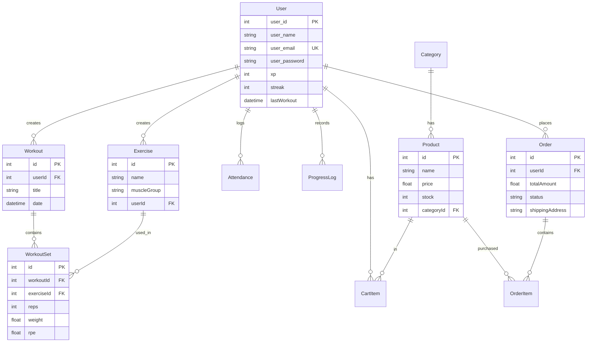

# FitFusion 💪

> **Production-grade Gym & Fitness Tracking + E-commerce Platform**
> Workout logging • XP gamification • Gym attendance • Body metrics • Fitness store

---

## Tech Stack

| Layer | Technology |
|-------|-----------|
| Frontend | React 19 + Vite 6 |
| Styling | TailwindCSS 4 |
| Routing | React Router DOM v6 |
| State | React Context + useReducer |
| Backend | Node.js + Express 5 |
| ORM | Prisma 6 |
| Database | PostgreSQL (Supabase) |
| Auth | JWT + bcryptjs + Google OAuth |
| Validation | Zod |

---

## Quick Start

### 1. Backend

```bash
cd backend
npm install
cp .env.example .env        # Fill in your credentials
npx prisma db push           # Sync schema to database
npx prisma db seed           # Populate test data
npm run dev                  # http://localhost:3000
```

### 2. Frontend

```bash
cd frontend
npm install
npm run dev                  # http://localhost:5173
```

### Test Login
```
Email: john@fitfusion.com
Password: password123
```

---

## Environment Variables

Create `backend/.env` from `.env.example`:

| Variable | Required | Description |
|----------|----------|-------------|
| `DATABASE_URL` | ✅ | Supabase pooled connection string |
| `DIRECT_URL` | ✅ | Supabase direct connection string |
| `JWT_SECRET` | ✅ | JWT signing secret (min 8 chars) |
| `GOOGLE_CLIENT_ID` | ❌ | Google OAuth Client ID |
| `FRONTEND_URL` | ❌ | CORS origin (default: `http://localhost:5173`) |
| `PORT` | ❌ | Server port (default: `3000`) |

---

## ER Diagram



---

## API Endpoints

### Auth
| Method | Endpoint | Auth | Description |
|--------|----------|------|-------------|
| POST | `/api/users/signup` | ❌ | Register → JWT |
| POST | `/api/users/login` | ❌ | Login → JWT |
| GET | `/api/users/profile` | ✅ | Get profile |
| PUT | `/api/users/profile` | ✅ | Update profile |
| POST | `/api/auth/google` | ❌ | Google OAuth → JWT |

### Fitness
| Method | Endpoint | Auth | Description |
|--------|----------|------|-------------|
| POST | `/api/exercises` | ✅ | Create exercise |
| GET | `/api/exercises` | ✅ | List exercises (?q= search) |
| POST | `/api/workouts` | ✅ | Create workout (+10 XP) |
| GET | `/api/workouts` | ✅ | List workouts (paginated) |
| GET | `/api/workouts/:id` | ✅ | Get workout detail |
| POST | `/api/workouts/:id/sets` | ✅ | Add set to workout |
| POST | `/api/attendance/checkin` | ✅ | Check in |
| POST | `/api/attendance/checkout` | ✅ | Check out |
| GET | `/api/attendance/today` | ✅ | Today's status |
| GET | `/api/attendance/history` | ✅ | History (?from, ?to, ?limit) |
| POST | `/api/progress` | ✅ | Log body metrics |
| GET | `/api/progress` | ✅ | Get progress history |

### E-commerce
| Method | Endpoint | Auth | Description |
|--------|----------|------|-------------|
| GET | `/api/products` | ❌ | List products (?category, ?search, paginated) |
| GET | `/api/products/:id` | ❌ | Product detail |
| POST | `/api/products` | ✅ | Create product |
| GET | `/api/products/categories` | ❌ | List categories |
| POST | `/api/products/categories` | ✅ | Create category |
| GET | `/api/cart` | ✅ | Get cart + total |
| POST | `/api/cart` | ✅ | Add to cart |
| PUT | `/api/cart/:id` | ✅ | Update quantity |
| DELETE | `/api/cart/:id` | ✅ | Remove item |
| DELETE | `/api/cart/clear` | ✅ | Clear cart |
| POST | `/api/orders` | ✅ | Create order (clears cart) |
| GET | `/api/orders` | ✅ | Order history |
| GET | `/api/orders/:id` | ✅ | Order detail |
| PUT | `/api/orders/:id/status` | ✅ | Update order status |

---

## Frontend Routes

| Path | Page | Auth | Description |
|------|------|------|-------------|
| `/` | Landing | ❌ | Hero, Features, Showcase, Pricing, Testimonials |
| `/login` | Login | ❌ | Email/password + Google OAuth |
| `/signup` | Signup | ❌ | Registration + Google OAuth |
| `/dashboard` | Dashboard | ✅ | XP bar, streak, recent workouts, quick actions |
| `/workouts` | Workouts | ✅ | Create workouts, add sets, view history |
| `/store` | Store | ✅ | Product catalog, cart sidebar, checkout |
| `/profile` | Profile | ✅ | Stats, edit profile, order history |

---

## XP & Streak System

- Each **workout** earns **+10 XP**
- **Streak rules:**
  - Last workout **yesterday** → streak +1
  - Last workout **today** → no change
  - Last workout **>1 day ago** → streak resets to 1

---

## Seed Data

| Entity | Count | Highlights |
|--------|-------|-----------|
| Users | 2 | John (150 XP, 5🔥), Jane (300 XP, 10🔥) |
| Exercises | 5 | Bench, Squat, Deadlift, OHP, Pull-ups |
| Workouts | 3 | With multiple sets each |
| Products | 5 | Across 3 categories |
| Orders | 2 | 1 delivered, 1 pending |

---

## Future Enhancements

- Password reset flow
- Admin dashboard with role-based access
- Workout templates & program builder
- Chart.js / Recharts analytics
- PWA support & offline mode
- Docker + CI/CD with GitHub Actions
- Refresh token rotation
- Social features (leaderboard, sharing)

---

## License

ISC © Ovais Koite